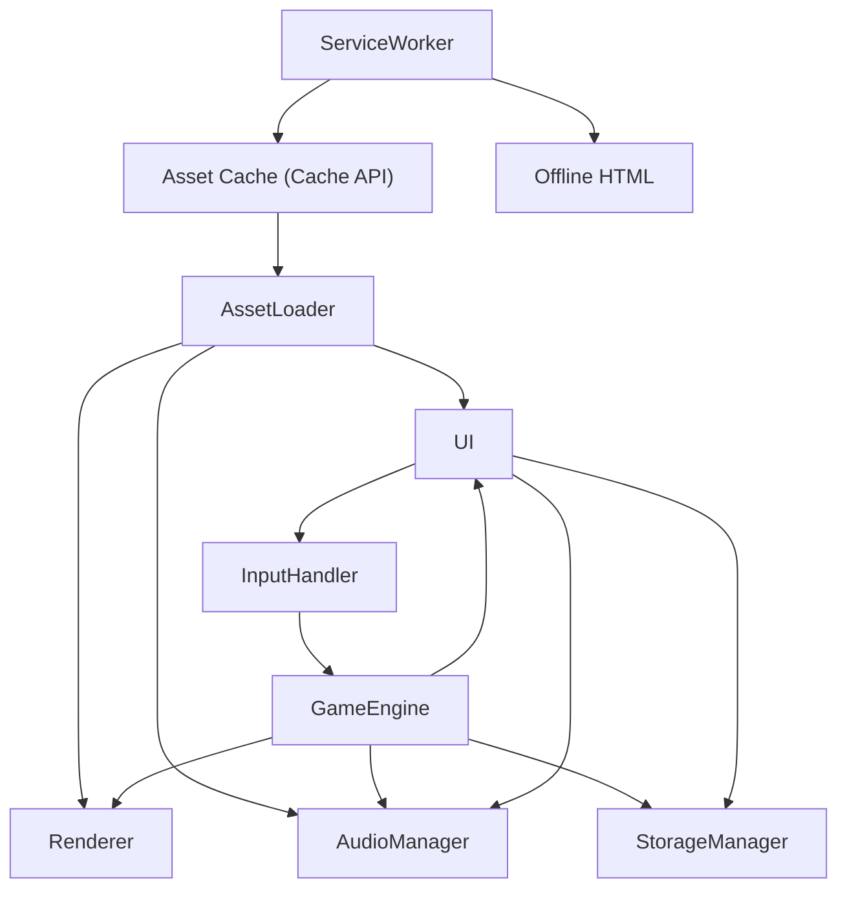

# Architect Mission Report

**Agent**: architect  
**Generated**: 2026-08-06T11:47:47.139Z

---

## Architecture Style

Modular Monolith (single‑page web application)

## Components

- **AssetLoader** (module): Loads all image, sprite sheet and audio files at game start and exposes them to other modules. Works with the Service Worker cache for offline reuse.
- **Renderer** (module): Draws the maze, Pac‑Man, ghosts, dots, fruit and UI overlays onto an HTML5 Canvas at 60 fps.
- **AudioManager** (module): Wraps the Web Audio API, plays background music, sound effects and respects the mute toggle.
- **InputHandler** (module): Normalises keyboard, WASD, swipe gestures and on‑screen button clicks into directional commands for the GameEngine.
- **GameEngine** (module): Core game loop, state machine, ghost AI, collision detection, scoring, level progression and pause handling.
- **UI** (module): Manages menus, HUD (score, lives, high‑score), pause overlay, countdown, game‑over screen and accessibility options.
- **StorageManager** (module): Persist high‑score list and user preferences (color‑blind mode, mute) using IndexedDB; provides a simple async API.
- **ServiceWorker** (service): Caches static assets (HTML, JS, CSS, images, audio) with the Cache API and serves an offline fallback page so the game works without network.

## Tech Stack

- **Language**: TypeScript 5.x — TypeScript adds static typing which prevents many runtime bugs in game logic (collision, AI) while compiling to plain JavaScript. It integrates seamlessly with Vite and React. JavaScript lacks type safety; Elm would require a whole new ecosystem and is overkill for a small game.
- **Build & Bundler**: Vite 5 — Vite offers lightning‑fast dev server start‑up, native ES module support, and produces highly optimized bundles with minimal configuration—ideal for keeping the final size under 2 MB. Webpack is more complex to configure for such a small project, and Parcel’s tree‑shaking is slightly less aggressive.
- **UI Framework**: React 18 (function components + hooks) — React provides a declarative way to build menus, HUD and accessibility features, and its ecosystem (React Testing Library) simplifies testing. Svelte would reduce bundle size but adds a compile step and a smaller talent pool. Vanilla HTML would require more manual DOM handling for focus management.
- **Rendering**: HTML5 Canvas API — Canvas is the classic, performant 2D raster solution for sprite‑based games and easily reaches 60 fps on mobile. SVG is vector‑oriented and slower for per‑frame pixel updates. WebGL is unnecessary complexity for a 2D pixel‑art game.
- **Audio**: Web Audio API (wrapped in a tiny TypeScript helper) — Web Audio gives precise control over playback rate, volume, and allows dynamic pitch changes for the siren effect. HTMLAudioElement lacks low‑latency control. Howler.js is a solid wrapper but adds extra kilobytes; a custom thin wrapper keeps the bundle under the size limit.
- **State Management**: React Context + useReducer — The game’s global state (score, lives, level) is modest; React Context + reducer provides a simple, type‑safe solution without extra dependencies. Redux adds boilerplate and bundle weight; MobX introduces observable magic that isn’t needed.
- **Persistence**: IndexedDB via idb library — IndexedDB handles structured data (high‑score objects) and scales better than LocalStorage, which is limited to ~5 MB and synchronous. WebSQL is deprecated.
- **Offline Support**: Service Worker with Cache API — A hand‑written Service Worker is only a few lines for this static game, keeping bundle size low. Workbox adds convenience but also extra code; AppCache is obsolete.
- **Testing**: Jest + React Testing Library — Jest provides fast unit test execution with built‑in mocking; React Testing Library encourages testing UI from the user’s perspective. Mocha requires more configuration; Cypress is great for end‑to‑end but overkill for core logic unit tests.
- **CI/CD**: GitHub Actions (node12+, Vite build, Jest test) — GitHub Actions integrates directly with the repository, needs no external service, and can run the simple build‑test pipeline in minutes. GitLab CI would require a GitLab instance; CircleCI adds external cost.
- **Hosting**: Static site hosting on Netlify — Netlify automatically serves the built static assets, provides built‑in HTTPS, and supports Service Workers out of the box. GitHub Pages lacks custom headers for CSP; Vercel is comparable but Netlify’s free tier includes edge‑caching which helps initial load performance.

## Epics

- **E1** Core Game Loop & State Machine: Implement the fixed‑timestep loop, entity updates, collision detection, scoring, life handling and pause/resume logic.
- **E2** Maze Rendering & Asset Management: Draw the static maze, walls, dots, power pellets and tunnel logic; load sprite sheets and cache them for offline use.
- **E3** Player Input & Controls: Support keyboard (arrow keys, WASD), touch swipe, and on‑screen directional buttons; ensure focus indicators for accessibility.
- **E4** Ghost AI & Behavior: Implement the four distinct chase strategies, scatter timers, frightened mode, speed changes, and eye‑return logic.
- **E5** Scoring, Lives & Extra Life System: Track points for dots, pellets, sequential ghost eats, fruit, and award an extra life at 10 000 points; display HUD updates.
- **E6** Level Progression & Difficulty Scaling: Advance to the next level after all pellets are cleared, increase ghost speed, shorten frightened time, and adjust scatter/chase ratios for at least 20 levels.
- **E7** Audio System & Mute Control: Play background siren, sound effects for dots, pellets, ghost eats, deaths, fruit, and extra lives; implement a global mute toggle.
- **E8** User Interface Screens: Create Start Screen, Countdown, Pause overlay, Level‑Complete transition, Game‑Over screen with initials entry, and high‑score list display.
- **E9** High‑Score Persistence & Offline Storage: Save top‑10 scores and user preferences (color‑blind mode, mute) in IndexedDB; load them on game start.
- **E10** Accessibility & Color‑Blind Mode: Ensure full keyboard navigation, visible focus outlines, ARIA labels, and provide an alternate ghost‑color palette for color‑vision deficiencies.
- **E11** Responsive Layout & Touch Controls: Adapt canvas size and UI scaling for screens from 375 px to 2560 px; add on‑screen directional buttons for touch devices.
- **E12** Performance Optimisation & Bundle Size Reduction: Lazy‑load audio assets, compress sprites, enable Vite’s code‑splitting, and verify 60 fps on target devices.
- **E13** Offline‑First Capability: Cache all static assets and the Service Worker fallback page so the game loads and runs without network after first visit.

## Architecture Diagram

