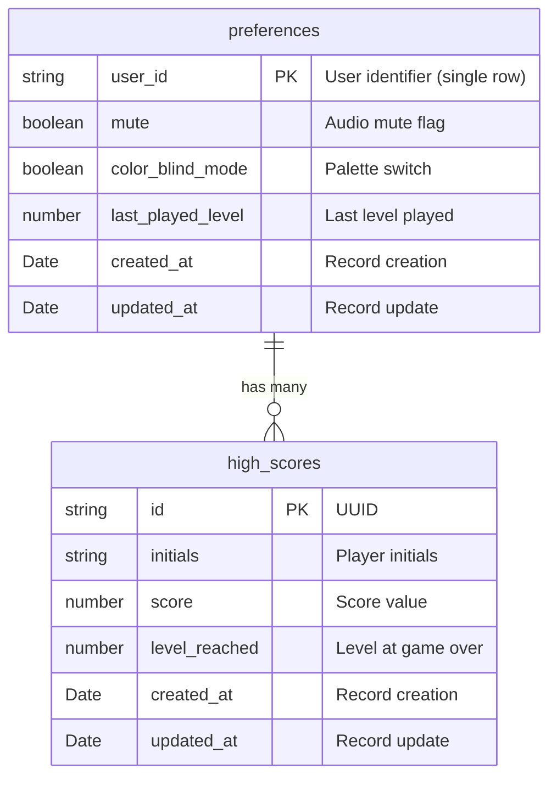

# DBA Mission Report

**Agent**: dba  
**Generated**: 2026-08-06T11:48:39.136Z

---

## Database Engine: IndexedDB (via idb library)

The application runs entirely in the browser and already uses IndexedDB through the idb wrapper for persisting high scores and user preferences. IndexedDB provides asynchronous, structured storage with indexed object stores, works offline, and scales beyond the 5 MB limit of LocalStorage. It aligns with the offline‑first NFR and avoids adding a server‑side database to a static site deployment.

## Entities (2)

- **high_scores**: 6 columns
- **preferences**: 6 columns

## ERD

