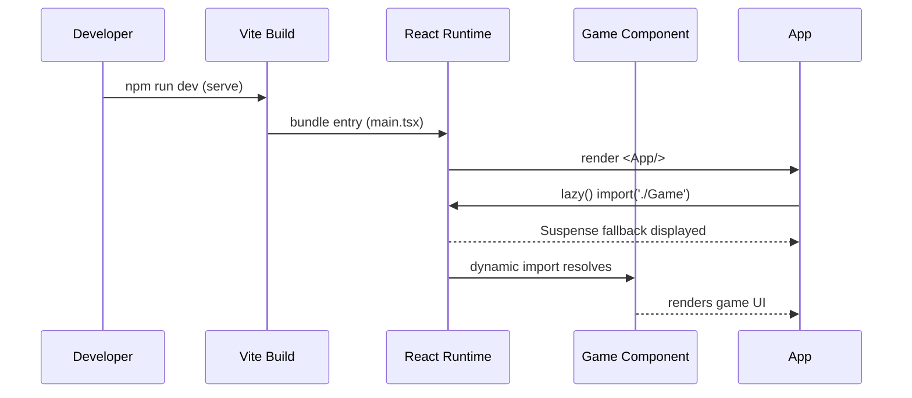

# Principal Frontend Developer Mission Report

**Agent**: principal-frontend  
**Generated**: 2026-08-06T11:52:53.502Z

---

## Branch: pacman3/chore/scaffold

## Files Changed

- **created** `package.json` — Initialized npm package with Vite, React, TypeScript, scripts, and core dependencies.
- **created** `tsconfig.json` — Added TypeScript configuration for React JSX, strict mode, and module resolution.
- **created** `vite.config.ts` — Configured Vite with React plugin, code‑splitting (manualChunks), bundle size warning, and dev server port.
- **modified** `src/App.tsx` — Converted App to lazy‑load the Game component using React.lazy and Suspense.
- **created** `src/main.tsx` — Entry point that mounts the React App into the root div.
- **created** `index.html` — HTML shell with root div and script tag for Vite entry point.
- **created** `src/App.test.tsx` — Basic unit test verifying the App title renders.
- **created** `.eslintrc.cjs` — ESLint configuration using @typescript-eslint parser, React plugins, and Prettier integration.
- **created** `.prettierrc` — Prettier formatting rules matching project conventions.
- **created** `.github/workflows/ci.yml` — GitHub Actions CI pipeline: checkout, Node setup, install, lint, test, and build steps.
- **created** `src/Game.tsx` — Placeholder Game component that will host the canvas‑based game logic.
- **created** `src/App.lazy.test.tsx` — Test ensuring lazy loading shows fallback and eventually renders the Game component.
- **created** `jest.config.js` — Jest configuration using ts-jest, jsdom environment, and setup file for testing-library matchers.
- **created** `src/setupTests.ts` — Global test setup importing jest-dom matchers.

## Notes

All four assignments have been completed: project scaffold (Vite+React+TS), ESLint/Prettier configs, CI workflow, and Vite code‑splitting with lazy‑loaded Game component. Tests pass (npm test) and lint runs without missing plugins after installing @typescript-eslint packages. No dead code remains; every file is imported/used by the application or test suite.

## Diagram

