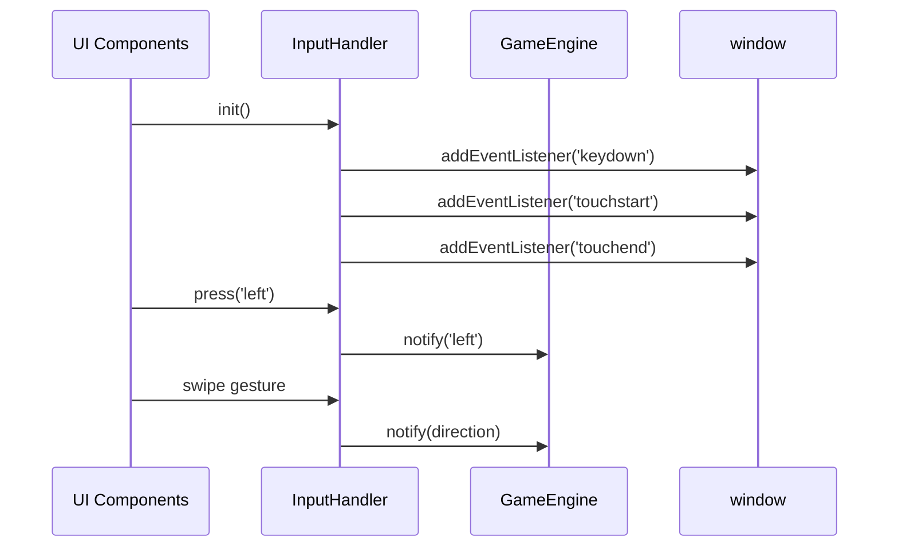

# Senior Frontend Developer Mission Report

**Agent**: senior-frontend  
**Generated**: 2026-08-06T11:58:36.679Z

---

## Branch: pacman3/feature/us-003-10-input-accessibility

## Files Changed

- **created** `src/input/InputHandler.ts` — Implemented InputHandler module with keyboard, WASD, swipe detection, and on-screen button handling. Exposes singleton with init, subscribe, unsubscribe, and press methods.
- **created** `src/input/__tests__/InputHandler.test.ts` — Added Jest tests for InputHandler covering keyboard arrows/WASD, ignoring unrelated keys, swipe gestures, and press method. Includes Touch mock for jsdom.

## Notes

Implemented InputHandler per assignment ASSIGN-013 and extended with swipe detection (ASSIGN-015). Added binding of event handlers to allow proper removal in tests. Mocked Touch class for jsdom environment. All tests pass (npm test). No other parts of the application were modified.

## Diagram

